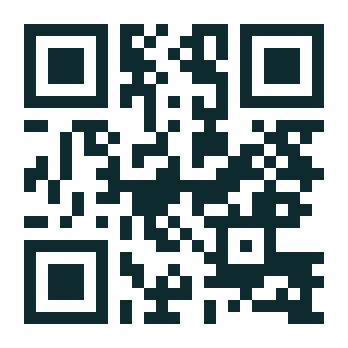

## {#cover}

::::::: {.frame .g48}

::::: {.row .g96 .top}

:::: {.col .grow .g32}

::: {.eyebrow}
Докато се настанявате
:::

::: {.d220}
Първият ход\
е ваш
:::

::: {.t64}
Имате 60 секунди
:::

::::

:::: {.col .w440 .g24}

::: {.qr}
{fig-alt="QR код към играта: intro.visiometrica.com"}
:::

::: {.t24 .tc}
Сканирайте с камерата на телефона\
или отворете [intro.visiometrica.com]{.c-ink .bold}
:::

::::

:::::

::: {.spacer}
:::

:::: {.ruler .c-body}

::: {.ruler-labels}
[0]{.lo} [100]{.hi}
:::

{fig-alt="Скала от 0 до 100"}

::::

:::::::

## {#rules}

::::::: {.frame .g48}

::::: {.row .g96 .top}

:::: {.col .grow .g32}

::: {.eyebrow}
Правилата
:::

::: {.d112}
Изберете число от 0 до 100
:::

::: {.t64}
Печели този, чието число е най-близо до [**2/3 от средното**]{.c-ink}, което са избрали всички в залата.
:::

::::

:::: {.col .w440 .g24}

::: {.qr}
{fig-alt="QR код към играта: intro.visiometrica.com"}
:::

::: {.t24 .tc}
Имате 60 секунди\
[intro.visiometrica.com]{.c-ink .bold}
:::

::::

:::::

::: {.spacer}
:::

:::: {.ruler .c-body}

::: {.ruler-labels}
[0]{.lo} [100]{.hi}
:::

{fig-alt="Скала от 0 до 100"}

::::

:::::::

## {#who}

::::::: {.frame .g32}

::: {.eyebrow}
Докато броим отговорите
:::

::: {.d112}
Доц. д-р Виктор Аврамов
:::

::::: {.grid3 .g64}

:::: {.card}

::: {.d64 .c-teal}
Преподавател, директор на Програмен съвет
:::

::: {.t36}
Водя курсове по теория на игрите, бизнес стратегии, статистика, взимане на решения на базата на данни.
:::

::::

:::: {.card}

::: {.d64 .c-teal}
Анализатор
:::

::: {.t36}
Коментирал съм въпроси, свързани с енергетика и икономика, в Bloomberg TV Bulgaria и БНР.
:::

::::

:::: {.card}

::: {.d64 .c-teal}
Консултант
:::

::: {.t36}
Работя по различни неща, обединени във Visiometrica.com
:::

::::

:::::

:::::::

## {#programa}

::::::: {.frame .rule}

:::::: {.rule-panel}

::: {.eyebrow}
Кредити
:::

::: {.d220 .c-teal}
250
:::

::: {.spacer}
:::

::: {.eyebrow}
За бакалавърската степен
:::

::: {.t36}
4 години\
8 семестъра по 30 кр.\
и 10 за дипломиране
:::

::::::

:::::: {.rule-body}

::: {.eyebrow}
Писаните правила
:::

::: {.d112}
Как се събират кредитите
:::

::: {.t64}
Програмната схема година по година: какво е задължително и къде избирате сами.
:::

::: {.spacer}
:::

::: {.legend}
[Курсове от програмата]{.chip .k-prog} [Основни научни направления (GENB)]{.chip .k-genb} [Семинар, проект, практика, стаж]{.chip .k-proj} [Общообразователни]{.chip .k-gen} [Дипломиране]{.chip .k-grad}
:::

::::::

:::::::

## {#karta}

::::::: {.frame .tight .g24}

:::: {.row .between .center}

::: {.eyebrow}
Картата на кредитите
:::

::: {.t24}
Всеки ред е семестър от 30 кредита, всяка клетка е един курс
:::

::::

```{=html}
<div class="cmap">
  <div class="cmap-part fragment" data-fragment-index="1">Първа и втора година: Факултет за базово образование</div>
  <div class="cmap-year fragment" data-fragment-index="1">
    <div class="cmap-ylabel">Първа<br>година</div>
    <div class="cmap-rows">
      <div class="cmap-row">
        <div class="cmap-sem">I</div>
        <div class="cmap-cells">
          <div class="cell k-prog" style="grid-column:1 / span 3"></div>
          <div class="cell k-prog" style="grid-column:4 / span 3"></div>
          <div class="cell k-prog" style="grid-column:7 / span 3"></div>
          <div class="cell k-prog" style="grid-column:10 / span 3"></div>
          <div class="cell k-prog" style="grid-column:13 / span 3"></div>
          <div class="blk-label k-prog" style="grid-column:1 / span 15"><b>Курсове от програмата</b><span> · 5 от 6</span></div>
          <div class="cell k-genb" style="grid-column:16 / span 3"></div>
          <div class="blk-label k-genb" style="grid-column:16 / span 3"><b>GENB</b></div>
          <div class="cell k-gen" style="grid-column:19 / span 6"></div>
          <div class="blk-label k-gen" style="grid-column:19 / span 6"><b>Чужд език</b></div>
          <div class="cell k-gen" style="grid-column:25 / span 3"></div>
          <div class="blk-label k-gen" style="grid-column:25 / span 3"><b>Бълг. език</b></div>
          <div class="cell k-gen" style="grid-column:28 / span 3"></div>
          <div class="blk-label k-gen" style="grid-column:28 / span 3"><b>Знания</b></div>
        </div>
        <div class="cmap-total">30 кр.</div>
      </div>
      <div class="cmap-row">
        <div class="cmap-sem">II</div>
        <div class="cmap-cells">
          <div class="cell k-prog" style="grid-column:1 / span 3"></div>
          <div class="cell k-prog" style="grid-column:4 / span 3"></div>
          <div class="cell k-prog" style="grid-column:7 / span 3"></div>
          <div class="cell k-prog" style="grid-column:10 / span 3"></div>
          <div class="cell k-prog" style="grid-column:13 / span 3"></div>
          <div class="blk-label k-prog" style="grid-column:1 / span 15"><b>Курсове от програмата</b><span> · 5 от 6</span></div>
          <div class="cell k-genb" style="grid-column:16 / span 3"></div>
          <div class="blk-label k-genb" style="grid-column:16 / span 3"><b>GENB</b></div>
          <div class="cell k-gen" style="grid-column:19 / span 6"></div>
          <div class="blk-label k-gen" style="grid-column:19 / span 6"><b>Чужд език</b></div>
          <div class="cell k-gen" style="grid-column:25 / span 3"></div>
          <div class="blk-label k-gen" style="grid-column:25 / span 3"><b>Бълг. език</b></div>
          <div class="cell k-gen" style="grid-column:28 / span 3"></div>
          <div class="blk-label k-gen" style="grid-column:28 / span 3"><b>Знания</b></div>
        </div>
        <div class="cmap-total">30 кр.</div>
      </div>
    </div>
  </div>
  <div class="cmap-year fragment" data-fragment-index="2">
    <div class="cmap-ylabel">Втора<br>година</div>
    <div class="cmap-rows">
      <div class="cmap-row">
        <div class="cmap-sem">III</div>
        <div class="cmap-cells">
          <div class="cell k-prog" style="grid-column:1 / span 3"></div>
          <div class="cell k-prog" style="grid-column:4 / span 3"></div>
          <div class="cell k-prog" style="grid-column:7 / span 3"></div>
          <div class="cell k-prog" style="grid-column:10 / span 3"></div>
          <div class="cell k-prog" style="grid-column:13 / span 3"></div>
          <div class="cell k-prog" style="grid-column:16 / span 3"></div>
          <div class="cell k-prog" style="grid-column:19 / span 3"></div>
          <div class="blk-label k-prog" style="grid-column:1 / span 21"><b>Курсове от програмата</b><span> · всички 7</span></div>
          <div class="cell k-genb" style="grid-column:22 / span 3"></div>
          <div class="cell k-genb" style="grid-column:25 / span 3"></div>
          <div class="blk-label k-genb" style="grid-column:22 / span 6"><b>GENB</b><span> · 2 от 4</span></div>
          <div class="cell k-gen" style="grid-column:28 / span 3"></div>
          <div class="blk-label k-gen" style="grid-column:28 / span 3"><b>Знания</b></div>
        </div>
        <div class="cmap-total">30 кр.</div>
      </div>
      <div class="cmap-row">
        <div class="cmap-sem">IV</div>
        <div class="cmap-cells">
          <div class="cell k-prog" style="grid-column:1 / span 3"></div>
          <div class="cell k-prog" style="grid-column:4 / span 3"></div>
          <div class="cell k-prog" style="grid-column:7 / span 3"></div>
          <div class="cell k-prog" style="grid-column:10 / span 3"></div>
          <div class="cell k-prog" style="grid-column:13 / span 3"></div>
          <div class="cell k-prog" style="grid-column:16 / span 3"></div>
          <div class="cell k-prog" style="grid-column:19 / span 3"></div>
          <div class="blk-label k-prog" style="grid-column:1 / span 21"><b>Курсове от програмата</b><span> · всички 7</span></div>
          <div class="cell k-genb" style="grid-column:22 / span 3"></div>
          <div class="cell k-genb" style="grid-column:25 / span 3"></div>
          <div class="blk-label k-genb" style="grid-column:22 / span 6"><b>GENB</b><span> · 2 от 4</span></div>
          <div class="cell k-gen" style="grid-column:28 / span 3"></div>
          <div class="blk-label k-gen" style="grid-column:28 / span 3"><b>Знания</b></div>
        </div>
        <div class="cmap-total">30 кр.</div>
      </div>
    </div>
  </div>
  <div class="cmap-part fragment" data-fragment-index="3">Трета и четвърта година: Бакалавърски факултет</div>
  <div class="cmap-year fragment" data-fragment-index="3">
    <div class="cmap-ylabel">Трета<br>година</div>
    <div class="cmap-rows">
      <div class="cmap-row">
        <div class="cmap-sem">V</div>
        <div class="cmap-cells">
          <div class="cell k-prog" style="grid-column:1 / span 3"></div>
          <div class="cell k-prog" style="grid-column:4 / span 3"></div>
          <div class="cell k-prog" style="grid-column:7 / span 3"></div>
          <div class="cell k-prog" style="grid-column:10 / span 3"></div>
          <div class="cell k-prog" style="grid-column:13 / span 3"></div>
          <div class="cell k-prog" style="grid-column:16 / span 3"></div>
          <div class="blk-label k-prog" style="grid-column:1 / span 18"><b>Курсове от програмата</b><span> · 6 от 7</span></div>
          <div class="cell k-proj" style="grid-column:19 / span 6"></div>
          <div class="blk-label k-proj" style="grid-column:19 / span 6"><b>Семинар</b><span> · 1 от 2</span></div>
          <div class="cell k-proj" style="grid-column:25 / span 6"></div>
          <div class="blk-label k-proj" style="grid-column:25 / span 6"><b>Практика</b></div>
        </div>
        <div class="cmap-total">30 кр.</div>
      </div>
      <div class="cmap-row">
        <div class="cmap-sem">VI</div>
        <div class="cmap-cells">
          <div class="cell k-prog" style="grid-column:1 / span 3"></div>
          <div class="cell k-prog" style="grid-column:4 / span 3"></div>
          <div class="cell k-prog" style="grid-column:7 / span 3"></div>
          <div class="cell k-prog" style="grid-column:10 / span 3"></div>
          <div class="cell k-prog" style="grid-column:13 / span 3"></div>
          <div class="cell k-prog" style="grid-column:16 / span 3"></div>
          <div class="blk-label k-prog" style="grid-column:1 / span 18"><b>Курсове от програмата</b><span> · 6 от 7</span></div>
          <div class="cell k-proj" style="grid-column:19 / span 6"></div>
          <div class="blk-label k-proj" style="grid-column:19 / span 6"><b>Семинар / проект</b></div>
          <div class="cell k-proj" style="grid-column:25 / span 6"></div>
          <div class="blk-label k-proj" style="grid-column:25 / span 6"><b>Практика</b></div>
        </div>
        <div class="cmap-total">30 кр.</div>
      </div>
    </div>
  </div>
  <div class="cmap-year fragment" data-fragment-index="4">
    <div class="cmap-ylabel">Четвърта<br>година</div>
    <div class="cmap-rows">
      <div class="cmap-row">
        <div class="cmap-sem">VII</div>
        <div class="cmap-cells">
          <div class="cell k-prog" style="grid-column:1 / span 3"></div>
          <div class="cell k-prog" style="grid-column:4 / span 3"></div>
          <div class="cell k-prog" style="grid-column:7 / span 3"></div>
          <div class="cell k-prog" style="grid-column:10 / span 3"></div>
          <div class="cell k-prog" style="grid-column:13 / span 3"></div>
          <div class="cell k-prog" style="grid-column:16 / span 3"></div>
          <div class="blk-label k-prog" style="grid-column:1 / span 18"><b>Курсове от програмата</b><span> · 6 от 8</span></div>
          <div class="cell k-proj" style="grid-column:19 / span 6"></div>
          <div class="blk-label k-proj" style="grid-column:19 / span 6"><b>Семинар</b><span> · 1 от 2</span></div>
          <div class="cell k-proj" style="grid-column:25 / span 6"></div>
          <div class="blk-label k-proj" style="grid-column:25 / span 6"><b>Стаж I</b></div>
        </div>
        <div class="cmap-total">30 кр.</div>
      </div>
      <div class="cmap-row">
        <div class="cmap-sem">VIII</div>
        <div class="cmap-cells">
          <div class="cell k-prog" style="grid-column:1 / span 3"></div>
          <div class="cell k-prog" style="grid-column:4 / span 3"></div>
          <div class="cell k-prog" style="grid-column:7 / span 3"></div>
          <div class="cell k-prog" style="grid-column:10 / span 3"></div>
          <div class="cell k-prog" style="grid-column:13 / span 3"></div>
          <div class="blk-label k-prog" style="grid-column:1 / span 15"><b>Курсове от програмата</b><span> · 5 от 7</span></div>
          <div class="cell k-proj" style="grid-column:16 / span 6"></div>
          <div class="blk-label k-proj" style="grid-column:16 / span 6"><b>Семинар / проект</b></div>
          <div class="cell k-proj" style="grid-column:22 / span 9"></div>
          <div class="blk-label k-proj" style="grid-column:22 / span 9"><b>Стаж II</b></div>
        </div>
        <div class="cmap-total">30 кр.</div>
      </div>
    </div>
  </div>
  <div class="cmap-year cmap-grad fragment" data-fragment-index="5">
    <div class="cmap-ylabel">Накрая</div>
    <div class="cmap-rows">
      <div class="cmap-row">
        <div class="cmap-sem"></div>
        <div class="cmap-cells">
          <div class="cell k-grad" style="grid-column:1 / span 10"></div>
          <div class="blk-label k-grad" style="grid-column:1 / span 10"><b>Дипломиране</b><span> · 10 кр.</span></div>
          <div class="cmap-sum" style="grid-column:12 / span 19"><b>Общо 250 кредита</b><span>8 семестъра × 30 кр. + 10 кр.; спортът е без кредити</span></div>
        </div>
        <div class="cmap-total"></div>
      </div>
    </div>
  </div>
</div>
```

::: {.spacer}
:::

::: {.legend}
[Курсове от програмата]{.chip .k-prog} [GENB]{.chip .k-genb} [Семинар, проект, практика, стаж]{.chip .k-proj} [Общообразователни]{.chip .k-gen} [Дипломиране]{.chip .k-grad}
:::

:::::::

## {#godina-1}

::::::: {.frame .tight .g32}

::: {.eyebrow}
Факултет за базово образование
:::

:::: {.row .g32 .baseline}

::: {.d112}
Първа година
:::

::: {.t64}
I и II семестър
:::

::::

```{=html}
<div class="cmap big">
  <div class="cmap-row">
    <div class="cmap-sem">I</div>
    <div class="cmap-cells">
      <div class="cell k-prog" style="grid-column:1 / span 3"></div>
      <div class="cell k-prog" style="grid-column:4 / span 3"></div>
      <div class="cell k-prog" style="grid-column:7 / span 3"></div>
      <div class="cell k-prog" style="grid-column:10 / span 3"></div>
      <div class="cell k-prog" style="grid-column:13 / span 3"></div>
      <div class="blk-label k-prog" style="grid-column:1 / span 15"><b>Курсове от програмата</b><span>15 кр., 5 от 6</span></div>
      <div class="cell k-genb" style="grid-column:16 / span 3"></div>
      <div class="blk-label k-genb" style="grid-column:16 / span 3"><b>GENB</b><span>1 от 2</span></div>
      <div class="cell k-gen" style="grid-column:19 / span 6"></div>
      <div class="blk-label k-gen" style="grid-column:19 / span 6"><b>Чужд език</b><span>6 кр.</span></div>
      <div class="cell k-gen" style="grid-column:25 / span 3"></div>
      <div class="blk-label k-gen" style="grid-column:25 / span 3"><b>Бълг. език</b><span>3 кр.</span></div>
      <div class="cell k-gen" style="grid-column:28 / span 3"></div>
      <div class="blk-label k-gen" style="grid-column:28 / span 3"><b>Знания</b><span>3 кр.</span></div>
    </div>
    <div class="cmap-total">30 кр.</div>
  </div>
  <div class="cmap-row">
    <div class="cmap-sem">II</div>
    <div class="cmap-cells">
      <div class="cell k-prog" style="grid-column:1 / span 3"></div>
      <div class="cell k-prog" style="grid-column:4 / span 3"></div>
      <div class="cell k-prog" style="grid-column:7 / span 3"></div>
      <div class="cell k-prog" style="grid-column:10 / span 3"></div>
      <div class="cell k-prog" style="grid-column:13 / span 3"></div>
      <div class="blk-label k-prog" style="grid-column:1 / span 15"><b>Курсове от програмата</b><span>15 кр., 5 от 6</span></div>
      <div class="cell k-genb" style="grid-column:16 / span 3"></div>
      <div class="blk-label k-genb" style="grid-column:16 / span 3"><b>GENB</b><span>1 от 2</span></div>
      <div class="cell k-gen" style="grid-column:19 / span 6"></div>
      <div class="blk-label k-gen" style="grid-column:19 / span 6"><b>Чужд език</b><span>6 кр.</span></div>
      <div class="cell k-gen" style="grid-column:25 / span 3"></div>
      <div class="blk-label k-gen" style="grid-column:25 / span 3"><b>Бълг. език</b><span>3 кр.</span></div>
      <div class="cell k-gen" style="grid-column:28 / span 3"></div>
      <div class="blk-label k-gen" style="grid-column:28 / span 3"><b>Знания</b><span>3 кр.</span></div>
    </div>
    <div class="cmap-total">30 кр.</div>
  </div>
</div>
```

::::: {.grid3 .g64}

:::: {.pcard .k-prog}

::: {.t36 .bold .c-ink}
Курсове от програмата
:::

::: {.num}
15 кр. на семестър
:::

По **5 от предложените 6** курса всеки семестър.

::::

:::: {.pcard .k-genb}

::: {.t36 .bold .c-ink}
Основни научни направления
:::

::: {.num}
3 кр. на семестър
:::

**1 двусеместриален** курс по избор от 2:

- Държавно и публично управление [GENB015]{.code}
- Право, политика, цивилизация [GENB091]{.code}

::::

:::: {.pcard .k-gen}

::: {.t36 .bold .c-ink}
Общообразователни
:::

::: {.num}
12 кр. на семестър
:::

- **Чужд език**, 6 кр.: ниво A1–C2, 6 езика; само в&nbsp;I и&nbsp;II семестър
- **Български език**, 3 кр.: двусеместриален
- **Курс за знания**, 3 кр.: 1 от около 80, по правило от друга област

::::

:::::

:::::::

## {#s2-0 .anim-slide auto-animate=true}
```{=html}
<div class="anim">
  <div class="a-eyebrow" data-id="eyebrow">Пример</div>
  <div class="a-title" data-id="title-0">II семестър: от каталога към програмата на студента</div>
  <div class="a-cap" data-id="cap-0">Каталогът предлага курсове; програмната схема казва колко и от какъв вид. Общо 30 кредита.</div>
  <div class="shelf-h" data-id="sh-prog" style="left:0px;top:192px;">Курсове от програмата: избират се 5 от 6</div>
  <div class="shelf-h" data-id="sh-genb" style="left:1040px;top:192px;">GENB: продължава от I семестър</div>
  <div class="shelf-h" data-id="sh-fl" style="left:0px;top:380px;">Чужд език според нивото (6 езика, A1–C2)</div>
  <div class="shelf-h" data-id="sh-bg" style="left:1040px;top:380px;">Български език: продължава</div>
  <div class="shelf-h" data-id="sh-kn" style="left:0px;top:568px;">Курсове за знания: 1 по избор (77 в каталога)</div>
  <div class="more" data-id="more" style="left:1344px;top:640px;">+ още 69</div>
  <div class="slot k-prog" data-id="slot-0" style="left:0px;top:824px;width:158px;">курс от програмата<br><b>3 кр.</b></div>
  <div class="slot k-prog" data-id="slot-1" style="left:166px;top:824px;width:158px;">курс от програмата<br><b>3 кр.</b></div>
  <div class="slot k-prog" data-id="slot-2" style="left:332px;top:824px;width:158px;">курс от програмата<br><b>3 кр.</b></div>
  <div class="slot k-prog" data-id="slot-3" style="left:498px;top:824px;width:158px;">курс от програмата<br><b>3 кр.</b></div>
  <div class="slot k-prog" data-id="slot-4" style="left:664px;top:824px;width:158px;">курс от програмата<br><b>3 кр.</b></div>
  <div class="slot k-genb" data-id="slot-5" style="left:830px;top:824px;width:158px;">GENB<br><b>2/2</b></div>
  <div class="slot k-gen" data-id="slot-6" style="left:996px;top:824px;width:324px;">чужд език<br><b>6 кр.</b></div>
  <div class="slot k-gen" data-id="slot-8" style="left:1328px;top:824px;width:158px;">български език<br><b>2/2</b></div>
  <div class="slot k-gen" data-id="slot-9" style="left:1494px;top:824px;width:158px;">курс за знания<br><b>3 кр.</b></div>
  <div class="c k-prog" data-id="ADMB041" style="left:0px;top:226px;width:158px;">
    <div class="code">ADMB041 · 3 кр.</div>
    <div class="t">Управленска етика</div>
  </div>
  <div class="c k-prog" data-id="ADMB834" style="left:166px;top:226px;width:158px;">
    <div class="code">ADMB834 · 3 кр.</div>
    <div class="t">Политики на ЕС</div>
  </div>
  <div class="c k-prog long" data-id="BAEB035" style="left:332px;top:226px;width:158px;">
    <div class="code">BAEB035 · 3 кр.</div>
    <div class="t">Икономическа (бизнес) статистика</div>
  </div>
  <div class="c k-prog xlong" data-id="BAEB045" style="left:498px;top:226px;width:158px;">
    <div class="code">BAEB045 · 3 кр.</div>
    <div class="t">Вземане на бизнес решения на базата на данни</div>
  </div>
  <div class="c k-prog long" data-id="BUBB201" style="left:664px;top:226px;width:158px;">
    <div class="code">BUBB201 · 3 кр.</div>
    <div class="t">Принципи на макро­икономиката</div>
  </div>
  <div class="c k-prog" data-id="BUBB401" style="left:830px;top:226px;width:158px;">
    <div class="code">BUBB401 · 3 кр.</div>
    <div class="t">Правни анализи</div>
  </div>
  <div class="c k-genb long" data-id="GENB015" style="left:1040px;top:226px;width:158px;">
    <div class="code">GENB015 · 2/2</div>
    <div class="t">Държавно и публично управление</div>
  </div>
  <div class="c k-genb long" data-id="GENB091" style="left:1206px;top:226px;width:158px;">
    <div class="code">GENB091 · 2/2</div>
    <div class="t">Право, политика, цивилизация</div>
  </div>
  <div class="c k-gen" data-id="OOLE312" style="left:0px;top:414px;width:324px;">
    <div class="code">OOLE312 · 6 кр.</div>
    <div class="t">Английски език, B1</div>
  </div>
  <div class="c k-gen" data-id="OOLE511" style="left:332px;top:414px;width:324px;">
    <div class="code">OOLE511 · 6 кр.</div>
    <div class="t">Английски език, B2</div>
  </div>
  <div class="c k-gen" data-id="OOLE221" style="left:664px;top:414px;width:324px;">
    <div class="code">OOLE221 · 6 кр.</div>
    <div class="t">Немски език, A2</div>
  </div>
  <div class="c k-gen" data-id="OOOK800" style="left:1040px;top:414px;width:158px;">
    <div class="code">OOOK800 · 2/2</div>
    <div class="t">Български език</div>
  </div>
  <div class="c k-gen xlong" data-id="OOOK805" style="left:1206px;top:414px;width:158px;">
    <div class="code">OOOK805 · 2/2</div>
    <div class="t">Бълг. език – академично писане и говорене</div>
  </div>
  <div class="c k-gen" data-id="OOOK051" style="left:0px;top:602px;width:158px;">
    <div class="code">OOOK051 · 3 кр.</div>
    <div class="t">Старогръцка култура</div>
  </div>
  <div class="c k-gen" data-id="OOOK109" style="left:166px;top:602px;width:158px;">
    <div class="code">OOOK109 · 3 кр.</div>
    <div class="t">Що е фотография</div>
  </div>
  <div class="c k-gen" data-id="OOOK064" style="left:332px;top:602px;width:158px;">
    <div class="code">OOOK064 · 3 кр.</div>
    <div class="t">Астрономия и астрофизика</div>
  </div>
  <div class="c k-gen" data-id="OOOK159" style="left:498px;top:602px;width:158px;">
    <div class="code">OOOK159 · 3 кр.</div>
    <div class="t">Между­културна комуникация</div>
  </div>
  <div class="c k-gen" data-id="OOOK233" style="left:664px;top:602px;width:158px;">
    <div class="code">OOOK233 · 3 кр.</div>
    <div class="t">История на музиката</div>
  </div>
  <div class="c k-gen" data-id="OOOK287" style="left:830px;top:602px;width:158px;">
    <div class="code">OOOK287 · 3 кр.</div>
    <div class="t">Геология за всеки</div>
  </div>
  <div class="c k-gen long" data-id="OOOK325" style="left:996px;top:602px;width:158px;">
    <div class="code">OOOK325 · 3 кр.</div>
    <div class="t">Ораторско майсторство</div>
  </div>
  <div class="c k-gen long" data-id="OOOK107" style="left:1162px;top:602px;width:158px;">
    <div class="code">OOOK107 · 3 кр.</div>
    <div class="t">Съкровищата на България</div>
  </div>
  <div class="row-h" data-id="rowlabel" style="left:0px;top:756px;">Програма на студента</div>
  <div class="counter" data-id="counter" style="top:724px;">0 / 30 кр.</div>
</div>
```

## {#s2-1 .anim-slide auto-animate=true}
```{=html}
<div class="anim">
  <div class="a-eyebrow" data-id="eyebrow">Пример</div>
  <div class="a-title" data-id="title-0">II семестър: от каталога към програмата на студента</div>
  <div class="a-cap" data-id="cap-1">1. Курсове от програмата: 5 от предложените 6, общо 15 кредита.</div>
  <div class="shelf-h" data-id="sh-prog" style="left:0px;top:192px;">Курсове от програмата: избират се 5 от 6</div>
  <div class="shelf-h" data-id="sh-genb" style="left:1040px;top:192px;">GENB: продължава от I семестър</div>
  <div class="shelf-h" data-id="sh-fl" style="left:0px;top:380px;">Чужд език според нивото (6 езика, A1–C2)</div>
  <div class="shelf-h" data-id="sh-bg" style="left:1040px;top:380px;">Български език: продължава</div>
  <div class="shelf-h" data-id="sh-kn" style="left:0px;top:568px;">Курсове за знания: 1 по избор (77 в каталога)</div>
  <div class="more" data-id="more" style="left:1344px;top:640px;">+ още 69</div>
  <div class="slot k-prog" data-id="slot-0" style="left:0px;top:824px;width:158px;">курс от програмата<br><b>3 кр.</b></div>
  <div class="slot k-prog" data-id="slot-1" style="left:166px;top:824px;width:158px;">курс от програмата<br><b>3 кр.</b></div>
  <div class="slot k-prog" data-id="slot-2" style="left:332px;top:824px;width:158px;">курс от програмата<br><b>3 кр.</b></div>
  <div class="slot k-prog" data-id="slot-3" style="left:498px;top:824px;width:158px;">курс от програмата<br><b>3 кр.</b></div>
  <div class="slot k-prog" data-id="slot-4" style="left:664px;top:824px;width:158px;">курс от програмата<br><b>3 кр.</b></div>
  <div class="slot k-genb" data-id="slot-5" style="left:830px;top:824px;width:158px;">GENB<br><b>2/2</b></div>
  <div class="slot k-gen" data-id="slot-6" style="left:996px;top:824px;width:324px;">чужд език<br><b>6 кр.</b></div>
  <div class="slot k-gen" data-id="slot-8" style="left:1328px;top:824px;width:158px;">български език<br><b>2/2</b></div>
  <div class="slot k-gen" data-id="slot-9" style="left:1494px;top:824px;width:158px;">курс за знания<br><b>3 кр.</b></div>
  <div class="c k-prog moving" data-id="ADMB041" style="left:0px;top:824px;width:158px;">
    <div class="code">ADMB041 · 3 кр.</div>
    <div class="t">Управленска етика</div>
  </div>
  <div class="c k-prog moving" data-id="ADMB834" style="left:166px;top:824px;width:158px;">
    <div class="code">ADMB834 · 3 кр.</div>
    <div class="t">Политики на ЕС</div>
  </div>
  <div class="c k-prog long moving" data-id="BAEB035" style="left:332px;top:824px;width:158px;">
    <div class="code">BAEB035 · 3 кр.</div>
    <div class="t">Икономическа (бизнес) статистика</div>
  </div>
  <div class="c k-prog xlong off" data-id="BAEB045" style="left:498px;top:226px;width:158px;">
    <div class="code">BAEB045 · 3 кр.</div>
    <div class="t">Вземане на бизнес решения на базата на данни</div>
  </div>
  <div class="c k-prog long moving" data-id="BUBB201" style="left:498px;top:824px;width:158px;">
    <div class="code">BUBB201 · 3 кр.</div>
    <div class="t">Принципи на макро­икономиката</div>
  </div>
  <div class="c k-prog moving" data-id="BUBB401" style="left:664px;top:824px;width:158px;">
    <div class="code">BUBB401 · 3 кр.</div>
    <div class="t">Правни анализи</div>
  </div>
  <div class="c k-genb long" data-id="GENB015" style="left:1040px;top:226px;width:158px;">
    <div class="code">GENB015 · 2/2</div>
    <div class="t">Държавно и публично управление</div>
  </div>
  <div class="c k-genb long" data-id="GENB091" style="left:1206px;top:226px;width:158px;">
    <div class="code">GENB091 · 2/2</div>
    <div class="t">Право, политика, цивилизация</div>
  </div>
  <div class="c k-gen" data-id="OOLE312" style="left:0px;top:414px;width:324px;">
    <div class="code">OOLE312 · 6 кр.</div>
    <div class="t">Английски език, B1</div>
  </div>
  <div class="c k-gen" data-id="OOLE511" style="left:332px;top:414px;width:324px;">
    <div class="code">OOLE511 · 6 кр.</div>
    <div class="t">Английски език, B2</div>
  </div>
  <div class="c k-gen" data-id="OOLE221" style="left:664px;top:414px;width:324px;">
    <div class="code">OOLE221 · 6 кр.</div>
    <div class="t">Немски език, A2</div>
  </div>
  <div class="c k-gen" data-id="OOOK800" style="left:1040px;top:414px;width:158px;">
    <div class="code">OOOK800 · 2/2</div>
    <div class="t">Български език</div>
  </div>
  <div class="c k-gen xlong" data-id="OOOK805" style="left:1206px;top:414px;width:158px;">
    <div class="code">OOOK805 · 2/2</div>
    <div class="t">Бълг. език – академично писане и говорене</div>
  </div>
  <div class="c k-gen" data-id="OOOK051" style="left:0px;top:602px;width:158px;">
    <div class="code">OOOK051 · 3 кр.</div>
    <div class="t">Старогръцка култура</div>
  </div>
  <div class="c k-gen" data-id="OOOK109" style="left:166px;top:602px;width:158px;">
    <div class="code">OOOK109 · 3 кр.</div>
    <div class="t">Що е фотография</div>
  </div>
  <div class="c k-gen" data-id="OOOK064" style="left:332px;top:602px;width:158px;">
    <div class="code">OOOK064 · 3 кр.</div>
    <div class="t">Астрономия и астрофизика</div>
  </div>
  <div class="c k-gen" data-id="OOOK159" style="left:498px;top:602px;width:158px;">
    <div class="code">OOOK159 · 3 кр.</div>
    <div class="t">Между­културна комуникация</div>
  </div>
  <div class="c k-gen" data-id="OOOK233" style="left:664px;top:602px;width:158px;">
    <div class="code">OOOK233 · 3 кр.</div>
    <div class="t">История на музиката</div>
  </div>
  <div class="c k-gen" data-id="OOOK287" style="left:830px;top:602px;width:158px;">
    <div class="code">OOOK287 · 3 кр.</div>
    <div class="t">Геология за всеки</div>
  </div>
  <div class="c k-gen long" data-id="OOOK325" style="left:996px;top:602px;width:158px;">
    <div class="code">OOOK325 · 3 кр.</div>
    <div class="t">Ораторско майсторство</div>
  </div>
  <div class="c k-gen long" data-id="OOOK107" style="left:1162px;top:602px;width:158px;">
    <div class="code">OOOK107 · 3 кр.</div>
    <div class="t">Съкровищата на България</div>
  </div>
  <div class="badge" data-id="b-BAEB045" style="left:498px;top:350px;">не е избран (5 от 6)</div>
  <div class="row-h" data-id="rowlabel" style="left:0px;top:756px;">Програма на студента</div>
  <div class="counter" data-id="counter" style="top:724px;">15 / 30 кр.</div>
</div>
```

## {#s2-2 .anim-slide auto-animate=true}
```{=html}
<div class="anim">
  <div class="a-eyebrow" data-id="eyebrow">Пример</div>
  <div class="a-title" data-id="title-0">II семестър: от каталога към програмата на студента</div>
  <div class="a-cap" data-id="cap-2">2. Двусеместриалните курсове продължават от I семестър: GENB и български език.</div>
  <div class="shelf-h" data-id="sh-prog" style="left:0px;top:192px;">Курсове от програмата: избират се 5 от 6</div>
  <div class="shelf-h" data-id="sh-genb" style="left:1040px;top:192px;">GENB: продължава от I семестър</div>
  <div class="shelf-h" data-id="sh-fl" style="left:0px;top:380px;">Чужд език според нивото (6 езика, A1–C2)</div>
  <div class="shelf-h" data-id="sh-bg" style="left:1040px;top:380px;">Български език: продължава</div>
  <div class="shelf-h" data-id="sh-kn" style="left:0px;top:568px;">Курсове за знания: 1 по избор (77 в каталога)</div>
  <div class="more" data-id="more" style="left:1344px;top:640px;">+ още 69</div>
  <div class="slot k-prog" data-id="slot-0" style="left:0px;top:824px;width:158px;">курс от програмата<br><b>3 кр.</b></div>
  <div class="slot k-prog" data-id="slot-1" style="left:166px;top:824px;width:158px;">курс от програмата<br><b>3 кр.</b></div>
  <div class="slot k-prog" data-id="slot-2" style="left:332px;top:824px;width:158px;">курс от програмата<br><b>3 кр.</b></div>
  <div class="slot k-prog" data-id="slot-3" style="left:498px;top:824px;width:158px;">курс от програмата<br><b>3 кр.</b></div>
  <div class="slot k-prog" data-id="slot-4" style="left:664px;top:824px;width:158px;">курс от програмата<br><b>3 кр.</b></div>
  <div class="slot k-genb" data-id="slot-5" style="left:830px;top:824px;width:158px;">GENB<br><b>2/2</b></div>
  <div class="slot k-gen" data-id="slot-6" style="left:996px;top:824px;width:324px;">чужд език<br><b>6 кр.</b></div>
  <div class="slot k-gen" data-id="slot-8" style="left:1328px;top:824px;width:158px;">български език<br><b>2/2</b></div>
  <div class="slot k-gen" data-id="slot-9" style="left:1494px;top:824px;width:158px;">курс за знания<br><b>3 кр.</b></div>
  <div class="c k-prog" data-id="ADMB041" style="left:0px;top:824px;width:158px;">
    <div class="code">ADMB041 · 3 кр.</div>
    <div class="t">Управленска етика</div>
  </div>
  <div class="c k-prog" data-id="ADMB834" style="left:166px;top:824px;width:158px;">
    <div class="code">ADMB834 · 3 кр.</div>
    <div class="t">Политики на ЕС</div>
  </div>
  <div class="c k-prog long" data-id="BAEB035" style="left:332px;top:824px;width:158px;">
    <div class="code">BAEB035 · 3 кр.</div>
    <div class="t">Икономическа (бизнес) статистика</div>
  </div>
  <div class="c k-prog xlong off" data-id="BAEB045" style="left:498px;top:226px;width:158px;">
    <div class="code">BAEB045 · 3 кр.</div>
    <div class="t">Вземане на бизнес решения на базата на данни</div>
  </div>
  <div class="c k-prog long" data-id="BUBB201" style="left:498px;top:824px;width:158px;">
    <div class="code">BUBB201 · 3 кр.</div>
    <div class="t">Принципи на макро­икономиката</div>
  </div>
  <div class="c k-prog" data-id="BUBB401" style="left:664px;top:824px;width:158px;">
    <div class="code">BUBB401 · 3 кр.</div>
    <div class="t">Правни анализи</div>
  </div>
  <div class="c k-genb long moving" data-id="GENB015" style="left:830px;top:824px;width:158px;">
    <div class="code">GENB015 · 2/2</div>
    <div class="t">Държавно и публично управление</div>
  </div>
  <div class="c k-genb long off" data-id="GENB091" style="left:1206px;top:226px;width:158px;">
    <div class="code">GENB091 · 2/2</div>
    <div class="t">Право, политика, цивилизация</div>
  </div>
  <div class="c k-gen" data-id="OOLE312" style="left:0px;top:414px;width:324px;">
    <div class="code">OOLE312 · 6 кр.</div>
    <div class="t">Английски език, B1</div>
  </div>
  <div class="c k-gen" data-id="OOLE511" style="left:332px;top:414px;width:324px;">
    <div class="code">OOLE511 · 6 кр.</div>
    <div class="t">Английски език, B2</div>
  </div>
  <div class="c k-gen" data-id="OOLE221" style="left:664px;top:414px;width:324px;">
    <div class="code">OOLE221 · 6 кр.</div>
    <div class="t">Немски език, A2</div>
  </div>
  <div class="c k-gen moving" data-id="OOOK800" style="left:1328px;top:824px;width:158px;">
    <div class="code">OOOK800 · 2/2</div>
    <div class="t">Български език</div>
  </div>
  <div class="c k-gen xlong off" data-id="OOOK805" style="left:1206px;top:414px;width:158px;">
    <div class="code">OOOK805 · 2/2</div>
    <div class="t">Бълг. език – академично писане и говорене</div>
  </div>
  <div class="c k-gen" data-id="OOOK051" style="left:0px;top:602px;width:158px;">
    <div class="code">OOOK051 · 3 кр.</div>
    <div class="t">Старогръцка култура</div>
  </div>
  <div class="c k-gen" data-id="OOOK109" style="left:166px;top:602px;width:158px;">
    <div class="code">OOOK109 · 3 кр.</div>
    <div class="t">Що е фотография</div>
  </div>
  <div class="c k-gen" data-id="OOOK064" style="left:332px;top:602px;width:158px;">
    <div class="code">OOOK064 · 3 кр.</div>
    <div class="t">Астрономия и астрофизика</div>
  </div>
  <div class="c k-gen" data-id="OOOK159" style="left:498px;top:602px;width:158px;">
    <div class="code">OOOK159 · 3 кр.</div>
    <div class="t">Между­културна комуникация</div>
  </div>
  <div class="c k-gen" data-id="OOOK233" style="left:664px;top:602px;width:158px;">
    <div class="code">OOOK233 · 3 кр.</div>
    <div class="t">История на музиката</div>
  </div>
  <div class="c k-gen" data-id="OOOK287" style="left:830px;top:602px;width:158px;">
    <div class="code">OOOK287 · 3 кр.</div>
    <div class="t">Геология за всеки</div>
  </div>
  <div class="c k-gen long" data-id="OOOK325" style="left:996px;top:602px;width:158px;">
    <div class="code">OOOK325 · 3 кр.</div>
    <div class="t">Ораторско майсторство</div>
  </div>
  <div class="c k-gen long" data-id="OOOK107" style="left:1162px;top:602px;width:158px;">
    <div class="code">OOOK107 · 3 кр.</div>
    <div class="t">Съкровищата на България</div>
  </div>
  <div class="badge" data-id="b-BAEB045" style="left:498px;top:350px;">не е избран (5 от 6)</div>
  <div class="badge cont" data-id="b-GENB015" style="left:830px;top:794px;">от I семестър</div>
  <div class="badge cont" data-id="b-OOOK800" style="left:1328px;top:794px;">от I семестър</div>
  <div class="row-h" data-id="rowlabel" style="left:0px;top:756px;">Програма на студента</div>
  <div class="counter" data-id="counter" style="top:724px;">21 / 30 кр.</div>
</div>
```

## {#s2-3 .anim-slide auto-animate=true}
```{=html}
<div class="anim">
  <div class="a-eyebrow" data-id="eyebrow">Пример</div>
  <div class="a-title" data-id="title-0">II семестър: от каталога към програмата на студента</div>
  <div class="a-cap" data-id="cap-3">3. Чужд език според нивото: 6 кредита.</div>
  <div class="shelf-h" data-id="sh-prog" style="left:0px;top:192px;">Курсове от програмата: избират се 5 от 6</div>
  <div class="shelf-h" data-id="sh-genb" style="left:1040px;top:192px;">GENB: продължава от I семестър</div>
  <div class="shelf-h" data-id="sh-fl" style="left:0px;top:380px;">Чужд език според нивото (6 езика, A1–C2)</div>
  <div class="shelf-h" data-id="sh-bg" style="left:1040px;top:380px;">Български език: продължава</div>
  <div class="shelf-h" data-id="sh-kn" style="left:0px;top:568px;">Курсове за знания: 1 по избор (77 в каталога)</div>
  <div class="more" data-id="more" style="left:1344px;top:640px;">+ още 69</div>
  <div class="slot k-prog" data-id="slot-0" style="left:0px;top:824px;width:158px;">курс от програмата<br><b>3 кр.</b></div>
  <div class="slot k-prog" data-id="slot-1" style="left:166px;top:824px;width:158px;">курс от програмата<br><b>3 кр.</b></div>
  <div class="slot k-prog" data-id="slot-2" style="left:332px;top:824px;width:158px;">курс от програмата<br><b>3 кр.</b></div>
  <div class="slot k-prog" data-id="slot-3" style="left:498px;top:824px;width:158px;">курс от програмата<br><b>3 кр.</b></div>
  <div class="slot k-prog" data-id="slot-4" style="left:664px;top:824px;width:158px;">курс от програмата<br><b>3 кр.</b></div>
  <div class="slot k-genb" data-id="slot-5" style="left:830px;top:824px;width:158px;">GENB<br><b>2/2</b></div>
  <div class="slot k-gen" data-id="slot-6" style="left:996px;top:824px;width:324px;">чужд език<br><b>6 кр.</b></div>
  <div class="slot k-gen" data-id="slot-8" style="left:1328px;top:824px;width:158px;">български език<br><b>2/2</b></div>
  <div class="slot k-gen" data-id="slot-9" style="left:1494px;top:824px;width:158px;">курс за знания<br><b>3 кр.</b></div>
  <div class="c k-prog" data-id="ADMB041" style="left:0px;top:824px;width:158px;">
    <div class="code">ADMB041 · 3 кр.</div>
    <div class="t">Управленска етика</div>
  </div>
  <div class="c k-prog" data-id="ADMB834" style="left:166px;top:824px;width:158px;">
    <div class="code">ADMB834 · 3 кр.</div>
    <div class="t">Политики на ЕС</div>
  </div>
  <div class="c k-prog long" data-id="BAEB035" style="left:332px;top:824px;width:158px;">
    <div class="code">BAEB035 · 3 кр.</div>
    <div class="t">Икономическа (бизнес) статистика</div>
  </div>
  <div class="c k-prog xlong off" data-id="BAEB045" style="left:498px;top:226px;width:158px;">
    <div class="code">BAEB045 · 3 кр.</div>
    <div class="t">Вземане на бизнес решения на базата на данни</div>
  </div>
  <div class="c k-prog long" data-id="BUBB201" style="left:498px;top:824px;width:158px;">
    <div class="code">BUBB201 · 3 кр.</div>
    <div class="t">Принципи на макро­икономиката</div>
  </div>
  <div class="c k-prog" data-id="BUBB401" style="left:664px;top:824px;width:158px;">
    <div class="code">BUBB401 · 3 кр.</div>
    <div class="t">Правни анализи</div>
  </div>
  <div class="c k-genb long" data-id="GENB015" style="left:830px;top:824px;width:158px;">
    <div class="code">GENB015 · 2/2</div>
    <div class="t">Държавно и публично управление</div>
  </div>
  <div class="c k-genb long off" data-id="GENB091" style="left:1206px;top:226px;width:158px;">
    <div class="code">GENB091 · 2/2</div>
    <div class="t">Право, политика, цивилизация</div>
  </div>
  <div class="c k-gen off" data-id="OOLE312" style="left:0px;top:414px;width:324px;">
    <div class="code">OOLE312 · 6 кр.</div>
    <div class="t">Английски език, B1</div>
  </div>
  <div class="c k-gen moving" data-id="OOLE511" style="left:996px;top:824px;width:324px;">
    <div class="code">OOLE511 · 6 кр.</div>
    <div class="t">Английски език, B2</div>
  </div>
  <div class="c k-gen off" data-id="OOLE221" style="left:664px;top:414px;width:324px;">
    <div class="code">OOLE221 · 6 кр.</div>
    <div class="t">Немски език, A2</div>
  </div>
  <div class="c k-gen" data-id="OOOK800" style="left:1328px;top:824px;width:158px;">
    <div class="code">OOOK800 · 2/2</div>
    <div class="t">Български език</div>
  </div>
  <div class="c k-gen xlong off" data-id="OOOK805" style="left:1206px;top:414px;width:158px;">
    <div class="code">OOOK805 · 2/2</div>
    <div class="t">Бълг. език – академично писане и говорене</div>
  </div>
  <div class="c k-gen" data-id="OOOK051" style="left:0px;top:602px;width:158px;">
    <div class="code">OOOK051 · 3 кр.</div>
    <div class="t">Старогръцка култура</div>
  </div>
  <div class="c k-gen" data-id="OOOK109" style="left:166px;top:602px;width:158px;">
    <div class="code">OOOK109 · 3 кр.</div>
    <div class="t">Що е фотография</div>
  </div>
  <div class="c k-gen" data-id="OOOK064" style="left:332px;top:602px;width:158px;">
    <div class="code">OOOK064 · 3 кр.</div>
    <div class="t">Астрономия и астрофизика</div>
  </div>
  <div class="c k-gen" data-id="OOOK159" style="left:498px;top:602px;width:158px;">
    <div class="code">OOOK159 · 3 кр.</div>
    <div class="t">Между­културна комуникация</div>
  </div>
  <div class="c k-gen" data-id="OOOK233" style="left:664px;top:602px;width:158px;">
    <div class="code">OOOK233 · 3 кр.</div>
    <div class="t">История на музиката</div>
  </div>
  <div class="c k-gen" data-id="OOOK287" style="left:830px;top:602px;width:158px;">
    <div class="code">OOOK287 · 3 кр.</div>
    <div class="t">Геология за всеки</div>
  </div>
  <div class="c k-gen long" data-id="OOOK325" style="left:996px;top:602px;width:158px;">
    <div class="code">OOOK325 · 3 кр.</div>
    <div class="t">Ораторско майсторство</div>
  </div>
  <div class="c k-gen long" data-id="OOOK107" style="left:1162px;top:602px;width:158px;">
    <div class="code">OOOK107 · 3 кр.</div>
    <div class="t">Съкровищата на България</div>
  </div>
  <div class="badge" data-id="b-BAEB045" style="left:498px;top:350px;">не е избран (5 от 6)</div>
  <div class="badge cont" data-id="b-GENB015" style="left:830px;top:794px;">от I семестър</div>
  <div class="badge cont" data-id="b-OOOK800" style="left:1328px;top:794px;">от I семестър</div>
  <div class="row-h" data-id="rowlabel" style="left:0px;top:756px;">Програма на студента</div>
  <div class="counter" data-id="counter" style="top:724px;">27 / 30 кр.</div>
</div>
```

## {#s2-4 .anim-slide auto-animate=true}
```{=html}
<div class="anim">
  <div class="a-eyebrow" data-id="eyebrow">Пример</div>
  <div class="a-title" data-id="title-0">II семестър: от каталога към програмата на студента</div>
  <div class="a-cap" data-id="cap-4">4. Един курс за знания, по правило от друга област: 3 кредита. Семестърът е пълен.</div>
  <div class="shelf-h" data-id="sh-prog" style="left:0px;top:192px;">Курсове от програмата: избират се 5 от 6</div>
  <div class="shelf-h" data-id="sh-genb" style="left:1040px;top:192px;">GENB: продължава от I семестър</div>
  <div class="shelf-h" data-id="sh-fl" style="left:0px;top:380px;">Чужд език според нивото (6 езика, A1–C2)</div>
  <div class="shelf-h" data-id="sh-bg" style="left:1040px;top:380px;">Български език: продължава</div>
  <div class="shelf-h" data-id="sh-kn" style="left:0px;top:568px;">Курсове за знания: 1 по избор (77 в каталога)</div>
  <div class="more" data-id="more" style="left:1344px;top:640px;">+ още 69</div>
  <div class="slot k-prog" data-id="slot-0" style="left:0px;top:824px;width:158px;">курс от програмата<br><b>3 кр.</b></div>
  <div class="slot k-prog" data-id="slot-1" style="left:166px;top:824px;width:158px;">курс от програмата<br><b>3 кр.</b></div>
  <div class="slot k-prog" data-id="slot-2" style="left:332px;top:824px;width:158px;">курс от програмата<br><b>3 кр.</b></div>
  <div class="slot k-prog" data-id="slot-3" style="left:498px;top:824px;width:158px;">курс от програмата<br><b>3 кр.</b></div>
  <div class="slot k-prog" data-id="slot-4" style="left:664px;top:824px;width:158px;">курс от програмата<br><b>3 кр.</b></div>
  <div class="slot k-genb" data-id="slot-5" style="left:830px;top:824px;width:158px;">GENB<br><b>2/2</b></div>
  <div class="slot k-gen" data-id="slot-6" style="left:996px;top:824px;width:324px;">чужд език<br><b>6 кр.</b></div>
  <div class="slot k-gen" data-id="slot-8" style="left:1328px;top:824px;width:158px;">български език<br><b>2/2</b></div>
  <div class="slot k-gen" data-id="slot-9" style="left:1494px;top:824px;width:158px;">курс за знания<br><b>3 кр.</b></div>
  <div class="c k-prog" data-id="ADMB041" style="left:0px;top:824px;width:158px;">
    <div class="code">ADMB041 · 3 кр.</div>
    <div class="t">Управленска етика</div>
  </div>
  <div class="c k-prog" data-id="ADMB834" style="left:166px;top:824px;width:158px;">
    <div class="code">ADMB834 · 3 кр.</div>
    <div class="t">Политики на ЕС</div>
  </div>
  <div class="c k-prog long" data-id="BAEB035" style="left:332px;top:824px;width:158px;">
    <div class="code">BAEB035 · 3 кр.</div>
    <div class="t">Икономическа (бизнес) статистика</div>
  </div>
  <div class="c k-prog xlong off" data-id="BAEB045" style="left:498px;top:226px;width:158px;">
    <div class="code">BAEB045 · 3 кр.</div>
    <div class="t">Вземане на бизнес решения на базата на данни</div>
  </div>
  <div class="c k-prog long" data-id="BUBB201" style="left:498px;top:824px;width:158px;">
    <div class="code">BUBB201 · 3 кр.</div>
    <div class="t">Принципи на макро­икономиката</div>
  </div>
  <div class="c k-prog" data-id="BUBB401" style="left:664px;top:824px;width:158px;">
    <div class="code">BUBB401 · 3 кр.</div>
    <div class="t">Правни анализи</div>
  </div>
  <div class="c k-genb long" data-id="GENB015" style="left:830px;top:824px;width:158px;">
    <div class="code">GENB015 · 2/2</div>
    <div class="t">Държавно и публично управление</div>
  </div>
  <div class="c k-genb long off" data-id="GENB091" style="left:1206px;top:226px;width:158px;">
    <div class="code">GENB091 · 2/2</div>
    <div class="t">Право, политика, цивилизация</div>
  </div>
  <div class="c k-gen off" data-id="OOLE312" style="left:0px;top:414px;width:324px;">
    <div class="code">OOLE312 · 6 кр.</div>
    <div class="t">Английски език, B1</div>
  </div>
  <div class="c k-gen" data-id="OOLE511" style="left:996px;top:824px;width:324px;">
    <div class="code">OOLE511 · 6 кр.</div>
    <div class="t">Английски език, B2</div>
  </div>
  <div class="c k-gen off" data-id="OOLE221" style="left:664px;top:414px;width:324px;">
    <div class="code">OOLE221 · 6 кр.</div>
    <div class="t">Немски език, A2</div>
  </div>
  <div class="c k-gen" data-id="OOOK800" style="left:1328px;top:824px;width:158px;">
    <div class="code">OOOK800 · 2/2</div>
    <div class="t">Български език</div>
  </div>
  <div class="c k-gen xlong off" data-id="OOOK805" style="left:1206px;top:414px;width:158px;">
    <div class="code">OOOK805 · 2/2</div>
    <div class="t">Бълг. език – академично писане и говорене</div>
  </div>
  <div class="c k-gen off" data-id="OOOK051" style="left:0px;top:602px;width:158px;">
    <div class="code">OOOK051 · 3 кр.</div>
    <div class="t">Старогръцка култура</div>
  </div>
  <div class="c k-gen off" data-id="OOOK109" style="left:166px;top:602px;width:158px;">
    <div class="code">OOOK109 · 3 кр.</div>
    <div class="t">Що е фотография</div>
  </div>
  <div class="c k-gen moving" data-id="OOOK064" style="left:1494px;top:824px;width:158px;">
    <div class="code">OOOK064 · 3 кр.</div>
    <div class="t">Астрономия и астрофизика</div>
  </div>
  <div class="c k-gen off" data-id="OOOK159" style="left:498px;top:602px;width:158px;">
    <div class="code">OOOK159 · 3 кр.</div>
    <div class="t">Между­културна комуникация</div>
  </div>
  <div class="c k-gen off" data-id="OOOK233" style="left:664px;top:602px;width:158px;">
    <div class="code">OOOK233 · 3 кр.</div>
    <div class="t">История на музиката</div>
  </div>
  <div class="c k-gen off" data-id="OOOK287" style="left:830px;top:602px;width:158px;">
    <div class="code">OOOK287 · 3 кр.</div>
    <div class="t">Геология за всеки</div>
  </div>
  <div class="c k-gen long off" data-id="OOOK325" style="left:996px;top:602px;width:158px;">
    <div class="code">OOOK325 · 3 кр.</div>
    <div class="t">Ораторско майсторство</div>
  </div>
  <div class="c k-gen long off" data-id="OOOK107" style="left:1162px;top:602px;width:158px;">
    <div class="code">OOOK107 · 3 кр.</div>
    <div class="t">Съкровищата на България</div>
  </div>
  <div class="badge" data-id="b-BAEB045" style="left:498px;top:350px;">не е избран (5 от 6)</div>
  <div class="badge cont" data-id="b-GENB015" style="left:830px;top:794px;">от I семестър</div>
  <div class="badge cont" data-id="b-OOOK800" style="left:1328px;top:794px;">от I семестър</div>
  <div class="row-h" data-id="rowlabel" style="left:0px;top:756px;">Програма на студента</div>
  <div class="counter full" data-id="counter" style="top:724px;">30 / 30 кр.</div>
</div>
```

## {#s2-5 .anim-slide auto-animate=true}
```{=html}
<div class="anim">
  <div class="a-eyebrow" data-id="eyebrow">Пример</div>
  <div class="a-title" data-id="title-1">Схемата казва колко, каталогът казва кои</div>
  <div class="a-cap" data-id="cap-5">Същият ред като II семестър в картата, но с курсовете на един студент.</div>
  <div class="shelf-h gone" data-id="sh-prog" style="left:0px;top:192px;">Курсове от програмата: избират се 5 от 6</div>
  <div class="shelf-h gone" data-id="sh-genb" style="left:1040px;top:192px;">GENB: продължава от I семестър</div>
  <div class="shelf-h gone" data-id="sh-fl" style="left:0px;top:380px;">Чужд език според нивото (6 езика, A1–C2)</div>
  <div class="shelf-h gone" data-id="sh-bg" style="left:1040px;top:380px;">Български език: продължава</div>
  <div class="shelf-h gone" data-id="sh-kn" style="left:0px;top:568px;">Курсове за знания: 1 по избор (77 в каталога)</div>
  <div class="more gone" data-id="more" style="left:1344px;top:640px;">+ още 69</div>
  <div class="slot k-prog gone" data-id="slot-0" style="left:0px;top:824px;width:158px;">курс от програмата<br><b>3 кр.</b></div>
  <div class="slot k-prog gone" data-id="slot-1" style="left:166px;top:824px;width:158px;">курс от програмата<br><b>3 кр.</b></div>
  <div class="slot k-prog gone" data-id="slot-2" style="left:332px;top:824px;width:158px;">курс от програмата<br><b>3 кр.</b></div>
  <div class="slot k-prog gone" data-id="slot-3" style="left:498px;top:824px;width:158px;">курс от програмата<br><b>3 кр.</b></div>
  <div class="slot k-prog gone" data-id="slot-4" style="left:664px;top:824px;width:158px;">курс от програмата<br><b>3 кр.</b></div>
  <div class="slot k-genb gone" data-id="slot-5" style="left:830px;top:824px;width:158px;">GENB<br><b>2/2</b></div>
  <div class="slot k-gen gone" data-id="slot-6" style="left:996px;top:824px;width:324px;">чужд език<br><b>6 кр.</b></div>
  <div class="slot k-gen gone" data-id="slot-8" style="left:1328px;top:824px;width:158px;">български език<br><b>2/2</b></div>
  <div class="slot k-gen gone" data-id="slot-9" style="left:1494px;top:824px;width:158px;">курс за знания<br><b>3 кр.</b></div>
  <div class="c k-prog" data-id="ADMB041" style="left:0px;top:660px;width:158px;">
    <div class="code">ADMB041 · 3 кр.</div>
    <div class="t">Управленска етика</div>
  </div>
  <div class="c k-prog" data-id="ADMB834" style="left:166px;top:660px;width:158px;">
    <div class="code">ADMB834 · 3 кр.</div>
    <div class="t">Политики на ЕС</div>
  </div>
  <div class="c k-prog long" data-id="BAEB035" style="left:332px;top:660px;width:158px;">
    <div class="code">BAEB035 · 3 кр.</div>
    <div class="t">Икономическа (бизнес) статистика</div>
  </div>
  <div class="c k-prog xlong off gone" data-id="BAEB045" style="left:498px;top:226px;width:158px;">
    <div class="code">BAEB045 · 3 кр.</div>
    <div class="t">Вземане на бизнес решения на базата на данни</div>
  </div>
  <div class="c k-prog long" data-id="BUBB201" style="left:498px;top:660px;width:158px;">
    <div class="code">BUBB201 · 3 кр.</div>
    <div class="t">Принципи на макро­икономиката</div>
  </div>
  <div class="c k-prog" data-id="BUBB401" style="left:664px;top:660px;width:158px;">
    <div class="code">BUBB401 · 3 кр.</div>
    <div class="t">Правни анализи</div>
  </div>
  <div class="c k-genb long" data-id="GENB015" style="left:830px;top:660px;width:158px;">
    <div class="code">GENB015 · 2/2</div>
    <div class="t">Държавно и публично управление</div>
  </div>
  <div class="c k-genb long off gone" data-id="GENB091" style="left:1206px;top:226px;width:158px;">
    <div class="code">GENB091 · 2/2</div>
    <div class="t">Право, политика, цивилизация</div>
  </div>
  <div class="c k-gen off gone" data-id="OOLE312" style="left:0px;top:414px;width:324px;">
    <div class="code">OOLE312 · 6 кр.</div>
    <div class="t">Английски език, B1</div>
  </div>
  <div class="c k-gen" data-id="OOLE511" style="left:996px;top:660px;width:324px;">
    <div class="code">OOLE511 · 6 кр.</div>
    <div class="t">Английски език, B2</div>
  </div>
  <div class="c k-gen off gone" data-id="OOLE221" style="left:664px;top:414px;width:324px;">
    <div class="code">OOLE221 · 6 кр.</div>
    <div class="t">Немски език, A2</div>
  </div>
  <div class="c k-gen" data-id="OOOK800" style="left:1328px;top:660px;width:158px;">
    <div class="code">OOOK800 · 2/2</div>
    <div class="t">Български език</div>
  </div>
  <div class="c k-gen xlong off gone" data-id="OOOK805" style="left:1206px;top:414px;width:158px;">
    <div class="code">OOOK805 · 2/2</div>
    <div class="t">Бълг. език – академично писане и говорене</div>
  </div>
  <div class="c k-gen off gone" data-id="OOOK051" style="left:0px;top:602px;width:158px;">
    <div class="code">OOOK051 · 3 кр.</div>
    <div class="t">Старогръцка култура</div>
  </div>
  <div class="c k-gen off gone" data-id="OOOK109" style="left:166px;top:602px;width:158px;">
    <div class="code">OOOK109 · 3 кр.</div>
    <div class="t">Що е фотография</div>
  </div>
  <div class="c k-gen" data-id="OOOK064" style="left:1494px;top:660px;width:158px;">
    <div class="code">OOOK064 · 3 кр.</div>
    <div class="t">Астрономия и астрофизика</div>
  </div>
  <div class="c k-gen off gone" data-id="OOOK159" style="left:498px;top:602px;width:158px;">
    <div class="code">OOOK159 · 3 кр.</div>
    <div class="t">Между­културна комуникация</div>
  </div>
  <div class="c k-gen off gone" data-id="OOOK233" style="left:664px;top:602px;width:158px;">
    <div class="code">OOOK233 · 3 кр.</div>
    <div class="t">История на музиката</div>
  </div>
  <div class="c k-gen off gone" data-id="OOOK287" style="left:830px;top:602px;width:158px;">
    <div class="code">OOOK287 · 3 кр.</div>
    <div class="t">Геология за всеки</div>
  </div>
  <div class="c k-gen long off gone" data-id="OOOK325" style="left:996px;top:602px;width:158px;">
    <div class="code">OOOK325 · 3 кр.</div>
    <div class="t">Ораторско майсторство</div>
  </div>
  <div class="c k-gen long off gone" data-id="OOOK107" style="left:1162px;top:602px;width:158px;">
    <div class="code">OOOK107 · 3 кр.</div>
    <div class="t">Съкровищата на България</div>
  </div>
  <div class="badge gone" data-id="b-BAEB045" style="left:498px;top:350px;">не е избран (5 от 6)</div>
  <div class="badge cont" data-id="b-GENB015" style="left:830px;top:630px;">от I семестър</div>
  <div class="badge cont" data-id="b-OOOK800" style="left:1328px;top:630px;">от I семестър</div>
  <div class="row-h" data-id="rowlabel" style="left:0px;top:592px;">Програма на студента: кои курсове</div>
  <div class="counter full" data-id="counter" style="top:560px;">30 / 30 кр.</div>
  <div class="row-h" data-id="schemalabel" style="left:0px;top:372px;">Програмна схема: колко и от какъв вид</div>
  <div class="seg k-prog" data-id="seg-0" style="left:0px;top:408px;width:822px;"><b>Курсове от програмата</b><span>15 кр., 5 от 6 курса</span></div>
  <div class="seg k-genb" data-id="seg-1" style="left:830px;top:408px;width:158px;"><b>GENB</b><span>1 от 2</span></div>
  <div class="seg k-gen" data-id="seg-2" style="left:996px;top:408px;width:324px;"><b>Чужд език</b><span>6 кр.</span></div>
  <div class="seg k-gen" data-id="seg-3" style="left:1328px;top:408px;width:158px;"><b>Бълг. език</b><span>3 кр.</span></div>
  <div class="seg k-gen" data-id="seg-4" style="left:1494px;top:408px;width:158px;"><b>Знания</b><span>3 кр.</span></div>
</div>
```

## {#godina-2}

::::::: {.frame .tight .g32}

::: {.eyebrow}
Факултет за базово образование
:::

:::: {.row .g32 .baseline}

::: {.d112}
Втора година
:::

::: {.t64}
III и IV семестър
:::

::::

```{=html}
<div class="cmap big">
  <div class="cmap-row">
    <div class="cmap-sem">III</div>
    <div class="cmap-cells">
      <div class="cell k-prog" style="grid-column:1 / span 3"></div>
      <div class="cell k-prog" style="grid-column:4 / span 3"></div>
      <div class="cell k-prog" style="grid-column:7 / span 3"></div>
      <div class="cell k-prog" style="grid-column:10 / span 3"></div>
      <div class="cell k-prog" style="grid-column:13 / span 3"></div>
      <div class="cell k-prog" style="grid-column:16 / span 3"></div>
      <div class="cell k-prog" style="grid-column:19 / span 3"></div>
      <div class="blk-label k-prog" style="grid-column:1 / span 21"><b>Курсове от програмата</b><span>21 кр., всички 7</span></div>
      <div class="cell k-genb" style="grid-column:22 / span 3"></div>
      <div class="cell k-genb" style="grid-column:25 / span 3"></div>
      <div class="blk-label k-genb" style="grid-column:22 / span 6"><b>GENB</b><span>6 кр., 2 от 4</span></div>
      <div class="cell k-gen" style="grid-column:28 / span 3"></div>
      <div class="blk-label k-gen" style="grid-column:28 / span 3"><b>Знания</b><span>3 кр.</span></div>
    </div>
    <div class="cmap-total">30 кр.</div>
  </div>
  <div class="cmap-row">
    <div class="cmap-sem">IV</div>
    <div class="cmap-cells">
      <div class="cell k-prog" style="grid-column:1 / span 3"></div>
      <div class="cell k-prog" style="grid-column:4 / span 3"></div>
      <div class="cell k-prog" style="grid-column:7 / span 3"></div>
      <div class="cell k-prog" style="grid-column:10 / span 3"></div>
      <div class="cell k-prog" style="grid-column:13 / span 3"></div>
      <div class="cell k-prog" style="grid-column:16 / span 3"></div>
      <div class="cell k-prog" style="grid-column:19 / span 3"></div>
      <div class="blk-label k-prog" style="grid-column:1 / span 21"><b>Курсове от програмата</b><span>21 кр., всички 7</span></div>
      <div class="cell k-genb" style="grid-column:22 / span 3"></div>
      <div class="cell k-genb" style="grid-column:25 / span 3"></div>
      <div class="blk-label k-genb" style="grid-column:22 / span 6"><b>GENB</b><span>6 кр., 2 от 4</span></div>
      <div class="cell k-gen" style="grid-column:28 / span 3"></div>
      <div class="blk-label k-gen" style="grid-column:28 / span 3"><b>Знания</b><span>3 кр.</span></div>
    </div>
    <div class="cmap-total">30 кр.</div>
  </div>
</div>
```

::::: {.grid3 .g64}

:::: {.pcard .k-prog}

::: {.t36 .bold .c-ink}
Курсове от програмата
:::

::: {.num}
21 кр. на семестър
:::

**Всички 7** курса всеки семестър.

::::

:::: {.pcard .k-genb}

::: {.t36 .bold .c-ink}
Основни научни направления
:::

::: {.num}
6 кр. на семестър
:::

**2 двусеместриални** курса по избор от 4:

- Общество, икономика и бизнес [GENB070]{.code}
- Предприемачество [GENB071]{.code}
- Потребителско поведение и жизнен стандарт [GENB072]{.code}
- Въведение в административни теории и системи [GENB073]{.code}

::::

:::: {.pcard .k-gen}

::: {.t36 .bold .c-ink}
Общообразователни
:::

::: {.num}
3 кр. на семестър
:::

**1 курс за знания** всеки семестър.

След IV семестър общото образование е завършено: **30 кр.** (чужд език 12, български език 6, знания 12).

::::

:::::

:::::::

## {#godina-3}

::::::: {.frame .tight .g32}

::: {.eyebrow}
Бакалавърски факултет
:::

:::: {.row .g32 .baseline}

::: {.d112}
Трета година
:::

::: {.t64}
V и VI семестър
:::

::::

```{=html}
<div class="cmap big">
  <div class="cmap-row">
    <div class="cmap-sem">V</div>
    <div class="cmap-cells">
      <div class="cell k-prog" style="grid-column:1 / span 3"></div>
      <div class="cell k-prog" style="grid-column:4 / span 3"></div>
      <div class="cell k-prog" style="grid-column:7 / span 3"></div>
      <div class="cell k-prog" style="grid-column:10 / span 3"></div>
      <div class="cell k-prog" style="grid-column:13 / span 3"></div>
      <div class="cell k-prog" style="grid-column:16 / span 3"></div>
      <div class="blk-label k-prog" style="grid-column:1 / span 18"><b>Курсове от програмата</b><span>18 кр., 6 от 7</span></div>
      <div class="cell k-proj" style="grid-column:19 / span 6"></div>
      <div class="blk-label k-proj" style="grid-column:19 / span 6"><b>Семинар</b><span>6 кр., 1 от 2</span></div>
      <div class="cell k-proj" style="grid-column:25 / span 6"></div>
      <div class="blk-label k-proj" style="grid-column:25 / span 6"><b>Практика</b><span>6 кр.</span></div>
    </div>
    <div class="cmap-total">30 кр.</div>
  </div>
  <div class="cmap-row">
    <div class="cmap-sem">VI</div>
    <div class="cmap-cells">
      <div class="cell k-prog" style="grid-column:1 / span 3"></div>
      <div class="cell k-prog" style="grid-column:4 / span 3"></div>
      <div class="cell k-prog" style="grid-column:7 / span 3"></div>
      <div class="cell k-prog" style="grid-column:10 / span 3"></div>
      <div class="cell k-prog" style="grid-column:13 / span 3"></div>
      <div class="cell k-prog" style="grid-column:16 / span 3"></div>
      <div class="blk-label k-prog" style="grid-column:1 / span 18"><b>Курсове от програмата</b><span>18 кр., 6 от 7</span></div>
      <div class="cell k-proj" style="grid-column:19 / span 6"></div>
      <div class="blk-label k-proj" style="grid-column:19 / span 6"><b>Семинар / проект</b><span>6 кр., 1 от 2</span></div>
      <div class="cell k-proj" style="grid-column:25 / span 6"></div>
      <div class="blk-label k-proj" style="grid-column:25 / span 6"><b>Практика</b><span>6 кр.</span></div>
    </div>
    <div class="cmap-total">30 кр.</div>
  </div>
</div>
```

::::: {.grid3 .g64}

:::: {.pcard .k-prog}

::: {.t36 .bold .c-ink}
Курсове от програмата
:::

::: {.num}
18 кр. на семестър
:::

По **6 от предложените 7** курса всеки семестър.

До 2 от тях (до 6 кр.) може да са от друга бакалавърска програма.

::::

:::: {.pcard .k-proj}

::: {.t36 .bold .c-ink}
Семинар или проект
:::

::: {.num}
6 кр. на семестър, 1 от 2
:::

::: {.sem}
V семестър
:::

- Еволюция на управленското мислене и практики
- Тренинг по лидерство и предприемачество

::: {.sem}
VI семестър
:::

- Семинар: Предприемачество и бизнес
- Проект: Лаборатория по стратегически симулации

::::

:::: {.pcard .k-proj}

::: {.t36 .bold .c-ink}
Практика
:::

::: {.num}
6 кр. на семестър, задължителна
:::

::: {.sem}
V семестър
:::

- Практика по бизнес администрация

::: {.sem}
VI семестър
:::

- Учебно-тренировъчна фирма

::::

:::::

:::::::

## {#godina-4}

::::::: {.frame .tight .g32}

::: {.eyebrow}
Бакалавърски факултет
:::

:::: {.row .g32 .baseline}

::: {.d112}
Четвърта година
:::

::: {.t64}
VII и VIII семестър
:::

::::

```{=html}
<div class="cmap big">
  <div class="cmap-row">
    <div class="cmap-sem">VII</div>
    <div class="cmap-cells">
      <div class="cell k-prog" style="grid-column:1 / span 3"></div>
      <div class="cell k-prog" style="grid-column:4 / span 3"></div>
      <div class="cell k-prog" style="grid-column:7 / span 3"></div>
      <div class="cell k-prog" style="grid-column:10 / span 3"></div>
      <div class="cell k-prog" style="grid-column:13 / span 3"></div>
      <div class="cell k-prog" style="grid-column:16 / span 3"></div>
      <div class="blk-label k-prog" style="grid-column:1 / span 18"><b>Курсове от програмата</b><span>18 кр., 6 от 8</span></div>
      <div class="cell k-proj" style="grid-column:19 / span 6"></div>
      <div class="blk-label k-proj" style="grid-column:19 / span 6"><b>Семинар</b><span>6 кр., 1 от 2</span></div>
      <div class="cell k-proj" style="grid-column:25 / span 6"></div>
      <div class="blk-label k-proj" style="grid-column:25 / span 6"><b>Стаж I</b><span>6 кр.</span></div>
    </div>
    <div class="cmap-total">30 кр.</div>
  </div>
  <div class="cmap-row">
    <div class="cmap-sem">VIII</div>
    <div class="cmap-cells">
      <div class="cell k-prog" style="grid-column:1 / span 3"></div>
      <div class="cell k-prog" style="grid-column:4 / span 3"></div>
      <div class="cell k-prog" style="grid-column:7 / span 3"></div>
      <div class="cell k-prog" style="grid-column:10 / span 3"></div>
      <div class="cell k-prog" style="grid-column:13 / span 3"></div>
      <div class="blk-label k-prog" style="grid-column:1 / span 15"><b>Курсове от програмата</b><span>15 кр., 5 от 7</span></div>
      <div class="cell k-proj" style="grid-column:16 / span 6"></div>
      <div class="blk-label k-proj" style="grid-column:16 / span 6"><b>Семинар / проект</b><span>6 кр., 1 от 2</span></div>
      <div class="cell k-proj" style="grid-column:22 / span 9"></div>
      <div class="blk-label k-proj" style="grid-column:22 / span 9"><b>Стаж II</b><span>9 кр.</span></div>
    </div>
    <div class="cmap-total">30 кр.</div>
  </div>
</div>
```

::::: {.grid3 .g64}

:::: {.pcard .k-prog}

::: {.t36 .bold .c-ink}
Курсове от програмата
:::

::: {.num}
VII: 18 кр., VIII: 15 кр.
:::

VII: **6 от 8** курса\
VIII: **5 от 7** курса

::::

:::: {.pcard .k-proj}

::: {.t36 .bold .c-ink}
Семинар или проект
:::

::: {.num}
6 кр. на семестър, 1 от 2
:::

::: {.sem}
VII семестър
:::

- Групова динамика и стратегическо мислене в бизнеса
- Корпоративно управление и организационна промяна

::: {.sem}
VIII семестър
:::

- Семинар: Разработване и реализация на проектна идея
- Проект: Стратегии и бизнес модели в дигиталната ера

::::

:::: {.pcard .k-proj}

::: {.t36 .bold .c-ink}
Стаж
:::

::: {.num}
VII: 6 кр., VIII: 9 кр., задължителен
:::

Стаж по бизнес администрация: I в VII семестър, II в VIII.

След VIII семестър: дипломиране, защита на бакалавърска теза или държавен изпит, 10 кр.

::::

:::::

:::::::

## {#izvan-kartata}

::::::: {.frame .g32}

::: {.d112}
Правила извън картата
:::

::::: {.grid2 .g64}

:::: {.card}

::: {.d64 .c-teal}
Спорт
:::

::: {.t24 .bold .c-body}
Веднъж, без кредити
:::

::: {.t36}
1 курс по спорт (30 ч.) в който и да е семестър; зачита се при поне 70% присъствие.
:::

::::

:::: {.card}

::: {.d64 .c-teal}
Курсове от други програми
:::

::: {.t24 .bold .c-body}
V–VIII семестър, до 6 кр.
:::

::: {.t36}
До 2 курса на семестър от други бакалавърски програми, без индивидуален план.
:::

::::

:::: {.card}

::: {.d64 .c-teal}
Minor: втора специалност
:::

::: {.t24 .bold .c-body}
V–VIII семестър, +30 кр. на семестър
:::

::: {.t36}
От друго професионално направление. Безплатна при успех поне Добър 4,00 от първите две години.
:::

::::

:::: {.card}

::: {.d64 .c-teal}
Какво е 1 кредит
:::

::: {.t24 .bold .c-body}
30 часа работа
:::

::: {.t36}
10 ч. в аудитория и 20 ч. самостоятелно. Курс от 3 кр.: 30 ч. занятия и 60 ч. сами.
:::

::::

:::::

:::::::

## {#platformi}

::::::: {.frame .g48}

::: {.d112}
Двете платформи, които ще ползвате
:::

::::: {.grid2 .g64}

:::: {.card}

::: {.d64 .c-teal}
e-Student
:::

::: {.t36 .bold .c-ink}
student.nbu.bg
:::

::: {.t36 .plain-list}
- Записване за семестъра, смяна на курсове
- Такса за семестъра
- Графици и приемно време
- Оценки и справки за взетите изпити
:::

::::

:::: {.card}

::: {.d64 .c-teal}
Moodle
:::

::: {.t36 .bold .c-ink}
e-edu.nbu.bg
:::

::: {.t36 .plain-list}
- Курсови материали: презентации, ресурси, учебници
- Тестове и предаване на курсови работи
- Форуми и съобщения до преподавателя
- Анкети за курсовете
:::

::::

:::::

::: {.spacer}
:::

::: {.t36}
И в двете влизате с факултетния си номер и парола.
:::

:::::::

## {#kogo-da-pitate}

::::::: {.frame}

::: {.d112}
Към кого да се обърнете
:::

::::: {.row .g64}

:::: {.card .grow}

::: {.t24 .bold .c-body .topic}
Курсове, изпити, среща с преподавател
:::

::: {.d64 .c-teal}
Преподавателите
:::

::: {.t36}
Пишете им по мейлите – може да ги видите от сайта на НБУ.
:::

::::

:::: {.card .grow}

::: {.t24 .bold .c-body .topic}
Административна помощ
:::

::: {.d64 .c-teal}
Елена\
Сарафова-Кузова
:::

::: {.t24}
секретар-специалист
:::

::: {.spacer}
:::

::: {.t36}
Понеделник–петък\
10:00–14:00 ч.\
Корпус 1, офис 401
:::

::: {.t36 .bold .c-ink}
am@nbu.bg
:::

::::

:::: {.card .grow}

::: {.t24 .bold .c-body .topic}
Смяна на курсове, записване, общи административни въпроси
:::

::: {.d64 .c-teal}
Студентски офис
:::

::::

:::::

:::::::

## {#rule0}

::::::: {.frame .rule}

:::::: {.rule-panel}

::: {.eyebrow}
Правило
:::

::: {.d220 .c-teal}
0
:::

::::::

:::::: {.rule-body}

::: {.eyebrow}
Неписаните правила
:::

::: {.d112}
Почти всеки в тази зала тайно се колебае, дали му е тук мястото
:::

::: {.t64}
Нормално е и ще мине с времето.
:::

::::::

:::::::

## {#rule1}

::::::: {.frame .rule}

:::::: {.rule-panel}

::: {.eyebrow}
Правило
:::

::: {.d220 .c-teal}
1
:::

::::::

:::::: {.rule-body}

::: {.d112}
Никой няма да ви напомня
:::

::: {.t64}
Сроковете са в графика.\
Сложете ги в телефона си още днес.
:::

::::::

:::::::

## {#rule2}

::::::: {.frame .rule}

:::::: {.rule-panel}

::: {.eyebrow}
Правило
:::

::: {.d220 .c-teal}
2
:::

::: {.spacer}
:::

::: {.eyebrow}
Моето приемно време
:::

::: {.t36}
Понеделник\
и четвъртък\
11:30–13:30\
Корпус 2, офис 620
:::

::::::

:::::: {.rule-body}

::: {.d112}
Контактувайте с преподавателите. Учудващо малко студенти го правят.
:::

::: {.t64}
Аз бих написал препоръка само на студент, който познавам. Статистическите данни показват, че по-активните студенти са по-успешни в живота.
:::

::::::

:::::::

## {#rule3}

::::::: {.frame .rule}

:::::: {.rule-panel}

::: {.eyebrow}
Правило
:::

::: {.d220 .c-teal}
3
:::

::::::

:::::: {.rule-body}

::: {.d112}
Имейл до преподавател
:::

::::: {.row .g32}

:::: {.card .email .w400}

::: {.eyebrow .c-body}
Това не прави добро впечатление
:::

::: {.t36 .italic .c-ink}
здравейте господине нямам оценка по вашия курс
:::

::: {.t24}
Без тема, без име на курса.
:::

::::

:::: {.card .email .good .grow}

::: {.eyebrow}
Така е доста по-добре
:::

::: {.t24 .bold .c-ink}
Тема: Въпрос за изпита по „Икономическа (бизнес) статистика“
:::

::: {.t24}
Уважаеми доц. Аврамов,
:::

::: {.t24}
Казвам се Ралица Кънчева, първи курс, „Управление на бизнеса и предприемачество“ (ф.&nbsp;н.&nbsp;F97438). Бих искала да попитам, дали материалите в Moodle са достатъчни за подготовка за теста за финално оценяване.
:::

::: {.t24}
С уважение,\
Ралица Кънчева
:::

::::

:::::

::: {.spacer}
:::

::: {.t24}
Длъжностите в един български университет по ред са: асистент, главен асистент, доцент, професор.\
„Д-р“ е степен, а не длъжност.
:::

::::::

:::::::

## {#rule4}

::::::: {.frame .rule}

:::::: {.rule-panel}

::: {.eyebrow}
Правило
:::

::: {.d220 .c-teal}
4
:::

::::::

:::::: {.rule-body}

::: {.d112}
Тук една грешка струва само най-много 3 кредита
:::

::: {.t64}
Запишете най-трудния курс.\
Бъдете смели и задавайте въпроси.
:::

::::::

:::::::

## {#ai-question}

::::::: {.frame .vcenter}

::: {.d112 .w1500}
Защо изобщо да сте тук, щом ChatGPT ще ви обясни всичко, което преподавам, безплатно и в&nbsp;три през нощта?
:::

:::::::

## {#peacock}

::::::: {.frame}

::: {.eyebrow}
Какво доказва дипломата
:::

::: {.d112}
Пазарът на употребявани автомобили
:::

::::: {.row .g64}

:::: {.card .grow}

::: {.d64 .c-teal}
Търговецът
:::

::: {.t36}
Всяка кола е излъскана, изглежда добре и само на 124 000 км. Това не е достоверен сигнал и проверката е скъпа.
:::

::: {.spacer}
:::

::: {.t24}
Джордж Акерлоф, 1970 (Нобелова награда, 2001)
:::

::::

:::: {.card .grow .fragment .fade-up}

::: {.d64 .c-teal}
Дипломата
:::

::: {.t36}
Идеята е същата, но работи по обратния начин: струва години труд и затова доказва неща, които не се виждат отвън.
:::

::: {.spacer}
:::

::: {.t24}
Майкъл Спенс, 1973 (Нобелова награда, 2001)
:::

::::

:::: {.card .grow .fragment .fade-up}

::: {.d64 .c-teal}
С ИИ
:::

::: {.t36}
Всеки може да бъде експерт. Пазарите работят с достоверни ангажименти.
:::

::::

:::::

:::::::

## {#forklift}

::::::: {.frame}

::: {.quote .w1400}
„Да пишете заданията си с ChatGPT е като да вкарате мотокар във фитнеса. Така никога няма да подобрите умствената си форма.“
:::

::: {.t24}
Тед Чанг, The New Yorker, 2024
:::

::: {.spacer}
:::

:::: {.divider}

::: {.eyebrow}
Моето правило
:::

::: {.t64 .bold .c-ink}
ChatGPT е ваш асистент и помощник. За всичко, което правите в университета, отговаряте само вие.
:::

::::

:::::::

## {#horizon}

::::::: {.frame}

::::: {.row .g96}

:::: {.col .grow .g8}

::: {.d220 .c-teal}
4
:::

::: {.t36}
години с хората в тази зала
:::

::::

:::: {.col .grow .g8}

::: {.d220 .c-teal}
40
:::

::: {.t36}
години в българския бизнес
:::

::::

:::::

::: {.spacer}
:::

::: {.d112}
В България хората не са много.\
Но имат дълга памет.
:::

::: {.t36}
Ниските оценки в дипломата остават.
:::

:::::::

## {#results}

::::::: {.frame .g32}

::: {.eyebrow}
Резултатите
:::

::: {.d220 .w1300}
Да видим какво решихте
:::

::: {.spacer}
:::

:::::: {.row .g64 .ladder}

::::: {.col .g4 .fragment}
::: {.d112 .c-teal}
50+
:::
::: {.t24}
Кой е над 50?
:::
:::::

::::: {.col .g4 .fragment}
::: {.d112 .c-teal}
33
:::
::: {.t24}
Около 33?
:::
:::::

::::: {.col .g4 .fragment}
::: {.d112 .c-teal}
22
:::
::: {.t24}
Около 22?
:::
:::::

::::: {.col .g4 .fragment}
::: {.d112 .c-teal}
15
:::
::: {.t24}
Около 15?
:::
:::::

::::: {.col .g4 .fragment}
::: {.d112 .c-teal}
10
:::
::: {.t24}
Под 10?
:::
:::::

::::: {.col .g4 .fragment}
::: {.d112 .c-teal}
0
:::
::: {.t24}
Нула?
:::
:::::

::::::

:::: {.ruler .c-body}

::: {.ruler-labels}
[0]{.lo} [100]{.hi}
:::

{fig-alt="Скала от 0 до 100"}

::::

:::::::

```{=html}
<iframe class="live-results" data-results="https://intro.visiometrica.com"
        title="Резултатите на живо" tabindex="-1"></iframe>
```

## {#map}

::::::: {.frame .vcenter}

::: {.t36 .w1100}
На хартия верният отговор е 0.
:::

::: {.d112 .w1400}
С истински хора нулата почти никога не печели
:::

::: {.t64 .semibold .c-teal}
Печели този, който най-добре е разчел залата.
:::

:::::::

## {#close}

::::::: {.frame .vcenter .with-signoff}

::: {.t36 .w1100}
Първия ход вече го направихте. Следващите четири години са хиляди такива ходове.
:::

::: {.d220}
Дипломата е сигнал.
:::

::: {.d112 .c-teal}
Погрижете се да е достоверен.
:::

::: {.qr-corner}
{fig-alt="QR код към слайдовете: quantumjazz.github.io/intro-new-students"}

[Слайдовете]{.bold .c-ink}
:::

::: {.signoff}
Доц. д-р Виктор Аврамов. Приемно време: понеделник и четвъртък, 11:30–13:30, корпус 2, офис 620
:::

:::::::

